# Google Play Store Data Analysis Project

## Project Overview
- This repository contains a comprehensive Exploratory Data Analysis (EDA) of the Google Play Store ecosystem.
- The objective is to analyze app characteristics, user ratings, pricing strategies, and content categories to uncover data-driven insights.
- The findings are intended to help stakeholders understand market trends and optimize app performance strategies.

## Repository Structure
- **data/**: Stores all raw and intermediate datasets used for analysis.
- **notebooks/**: Contains the core analytical workflows.
  - `01_cleaning.ipynb`: Scripts for handling missing values, data type conversions, and outlier treatment.
  - `02_eda.ipynb`: Scripts for generating summary statistics and initial data visualizations.
- **output/**: Houses the finalized, cleaned dataset (`playstore_clean.csv`) prepared for dashboard integration.
- **images/**: Contains all programmatic plots, charts, and graphical outputs.
- **Dashboard/**: Includes the final interactive Tableau workbook (`playstore_dashboard.twbx`) summarizing all key metrics.

## Key Insights and Visualizations
The analysis resulted in several significant findings regarding how apps are categorized and consumed. Below is a selection of the core plots generated during the EDA phase.

### Distribution by Category
- Highlights the concentration of apps across various genres and categories.
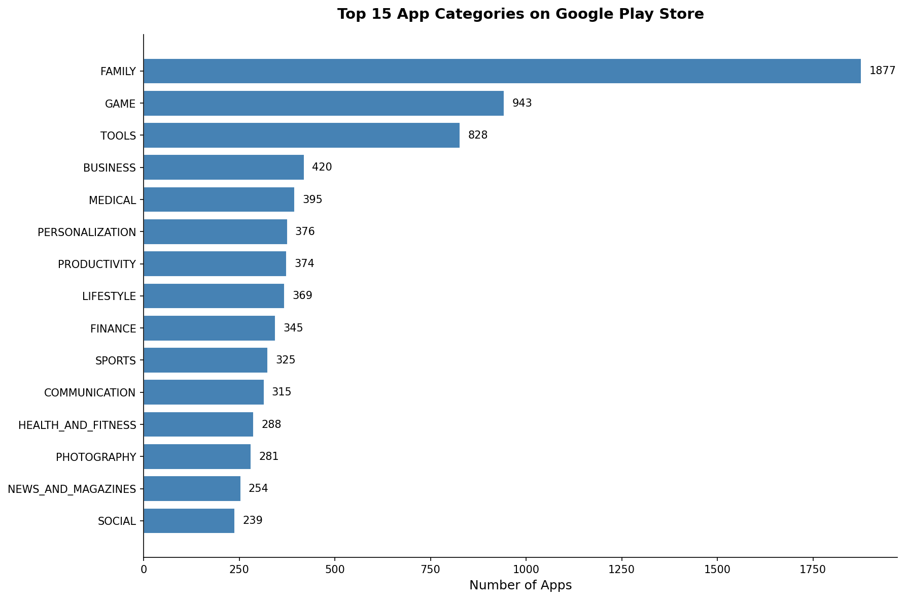

### Monetization Strategy
- Compares the proportion of free versus paid applications.
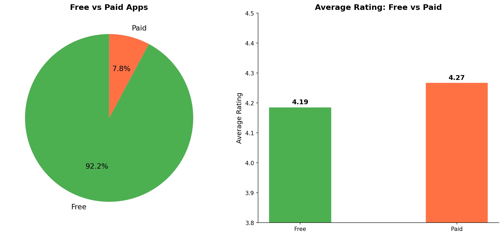

### User Ratings
- Examines the overall distribution and frequency of user ratings.
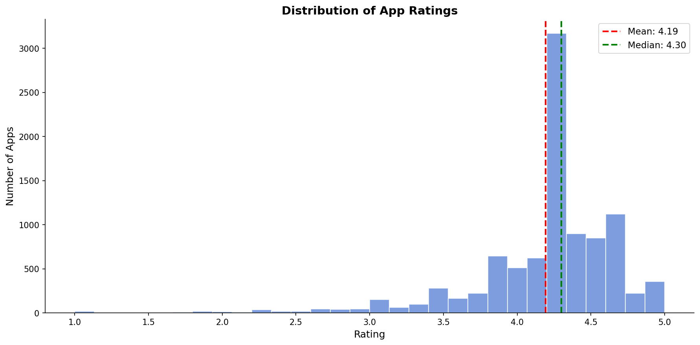

### Engagement Metrics
- Visualizes the total number of installations grouped by category.
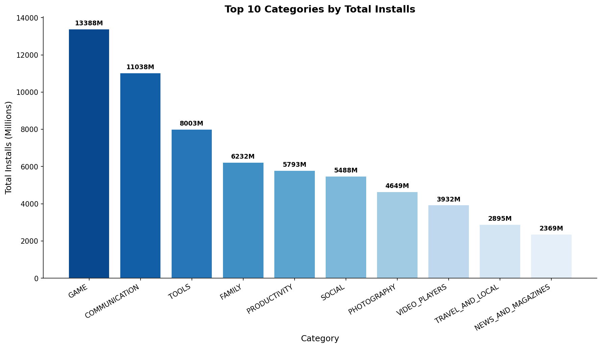

### Rating Variance
- Displays the spread and outliers in application ratings across categories.
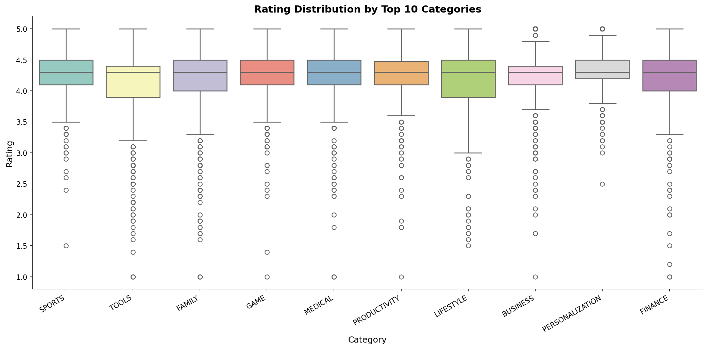

### App Relationships
- Investigates the correlation between different continuous variables such as price, size, and user rating.
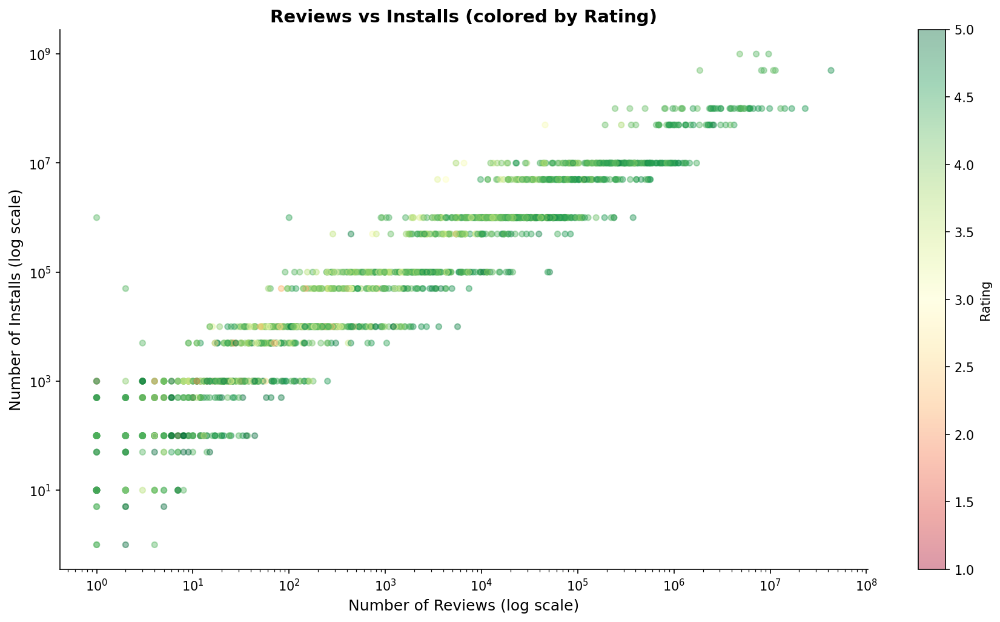

### Target Audience
- Breaks down the market share of applications based on content rating (e.g., Everyone, Teen, Mature).
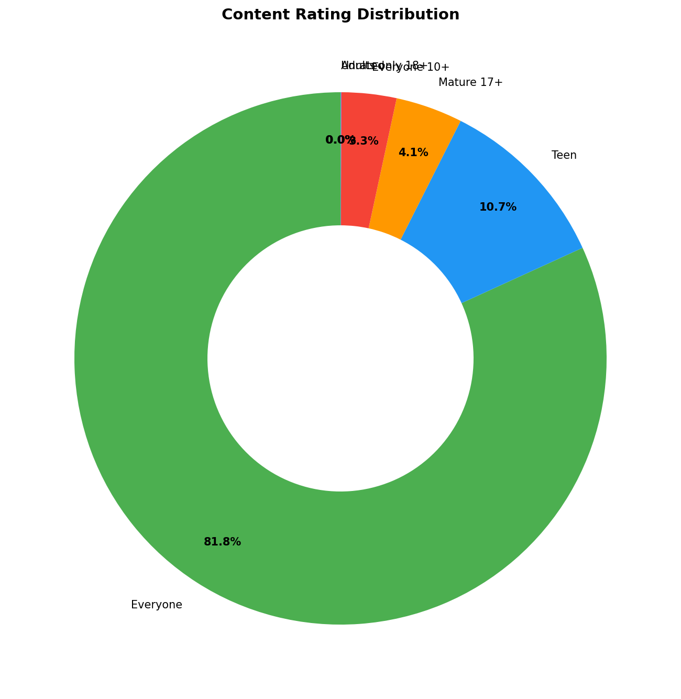

### Maintenance and Updates
- Tracks the volume of app updates published per year to gauge developer activity.
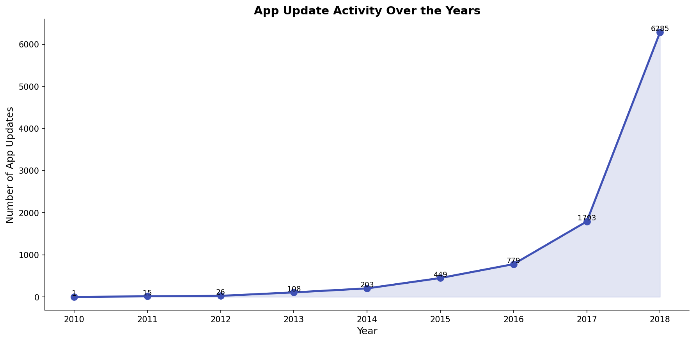

### File Size Optimization
- Illustrates the distribution of application file sizes across the ecosystem.
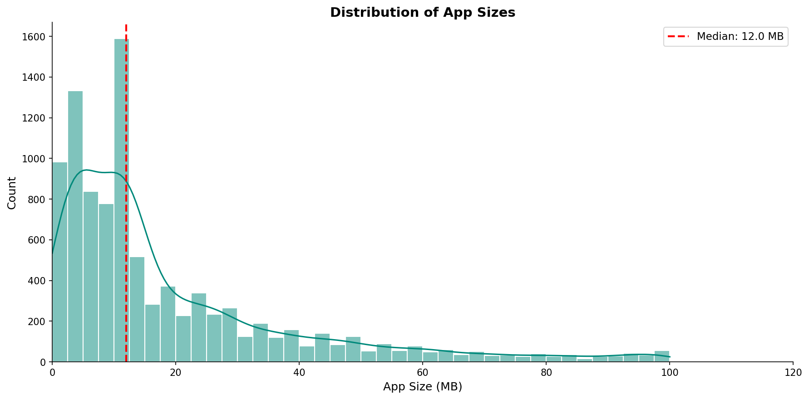

### Variable Correlation
- A statistical heatmap showing the relationships and dependencies between dataset features.
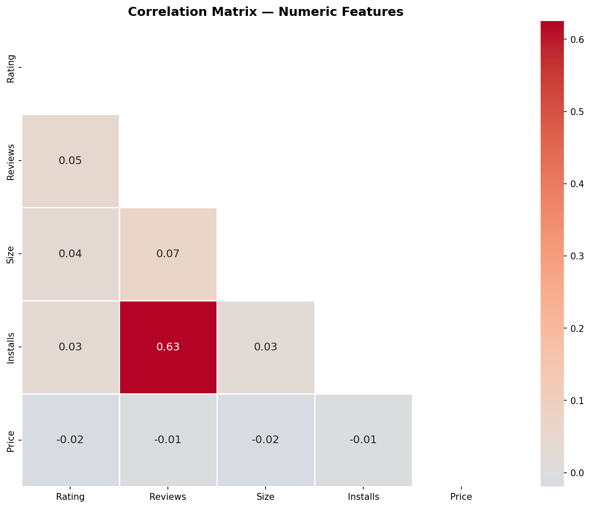

## Final Dashboard
- The culmination of the project is centralized in an interactive dashboard for high-level business intelligence.
- It provides a consolidated view of top-performing categories, app engagement, and market saturation.
- You can find the core dashboard file in the `Dashboard/` directory.

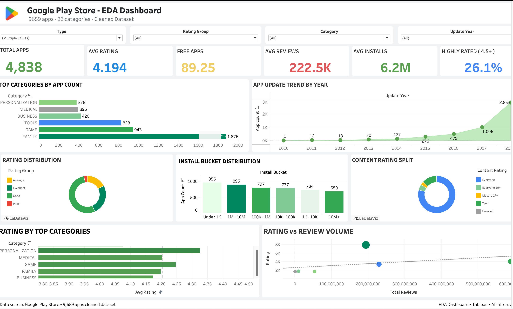

## Usage Instructions
- Clone the repository to your local environment.
- Install the required Python dependencies (e.g., pandas, matplotlib, seaborn).
- Run the notebooks sequentially from `01_cleaning.ipynb` to `02_eda.ipynb` to reproduce the analysis.
- Open the Tableau workbook in the `Dashboard/` folder to interact with the final presentation.
